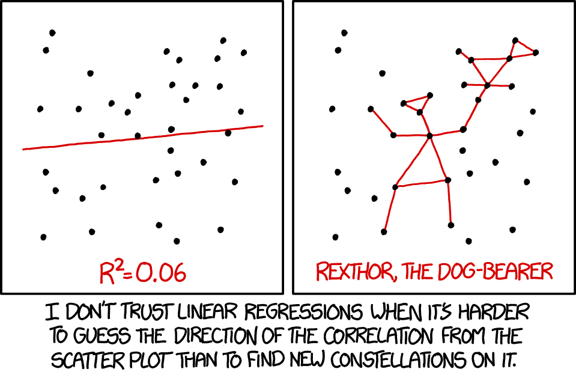
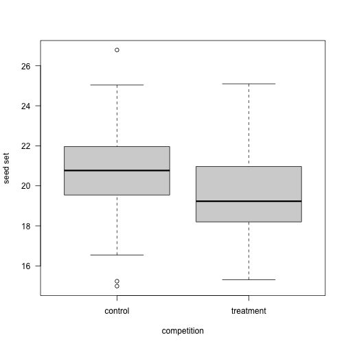
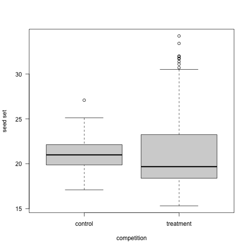

Common Sense Statistics
========================================================
author: Ignasi Bartomeus
date: 11 January 2021
autosize: true

Common Sense Statistics
========================================================

Common Sense Statistics
========================================================

> "He uses statistics as a drunken man uses lamp-posts... for support rather than illumination." - Andrew Lang (1844-1912)

Have a question
========================================================

Goal:  

- exploratory analysis  
- null hypothesis testing
- assessing the plausibility of different models
- interested in the model predictive power

Have a question
========================================================

Do not expect statistics to be easy
========================================================

- Dynamic field
- Opinionated field
- No cookbooks

> “If you only have a hammer, all your problems will look like nails”  

(but do not overdue it -> statistical machismo)

Do not expect statistics to be easy
========================================================

Do not expect statistics to be easy
========================================================

Be aware that statistical analysis can hardly fix a bad experimental design or poorly collected data.
========================================================

> "calling a statistician after the data has been collected is like calling a doctor to do an autopsia"

- Experimenta design
- Sample size
- (Power analysis)

Learn about researchers degrees of freedom
========================================================

- The Garden of forking paths
- p-hacking
- Pre-registration?

Always plot your data, even before running tests
========================================================

Always plot your data
========================================================

Understand the statistical test you are performing
========================================================

- model assumptions
- default parameters
- toy datasets  
- interpretation

Provide the full details of your statistical analyses. 
========================================================

- Report all test and data manipulation
- Frequentist: P-value, sample size, estimates and associated errors (SE or CI), coefficient of determination (r2), and interpretable effect sizes.
- Do not create Post-hoc hypothesis
- Bayesian CI's ~ p-values

Biological significance > statistical significance
========================================================

Biological significance > statistical significance
========================================================

Biological significance > statistical significance
========================================================

Biological significance > statistical significance
========================================================

Practice Open Science and reproducibility
========================================================

- Document choices (Git)
- Pair programming
- Errors are fine as long as are honest and we catch them.

